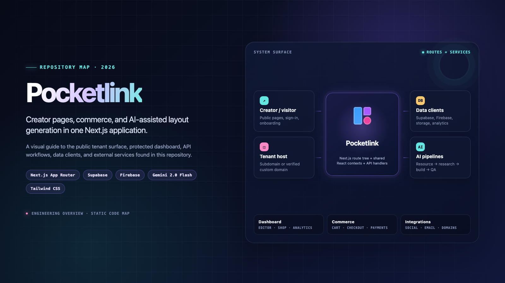
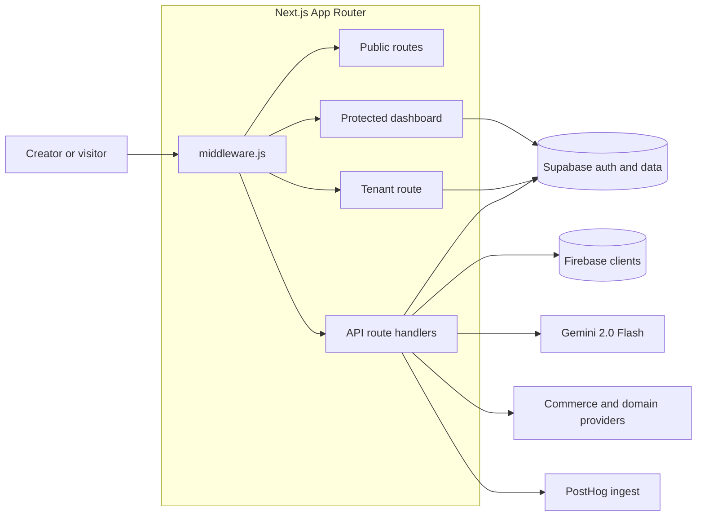
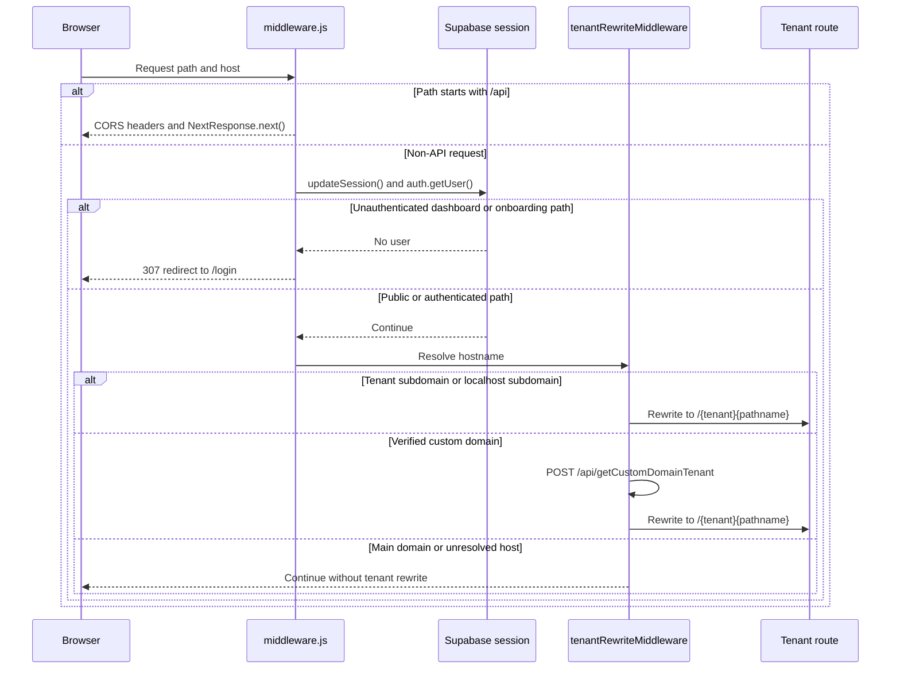
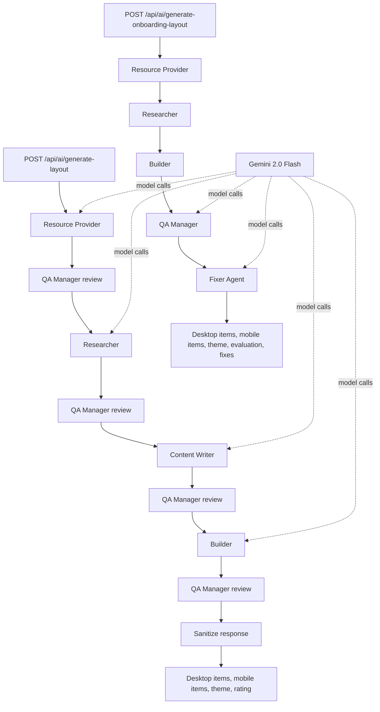
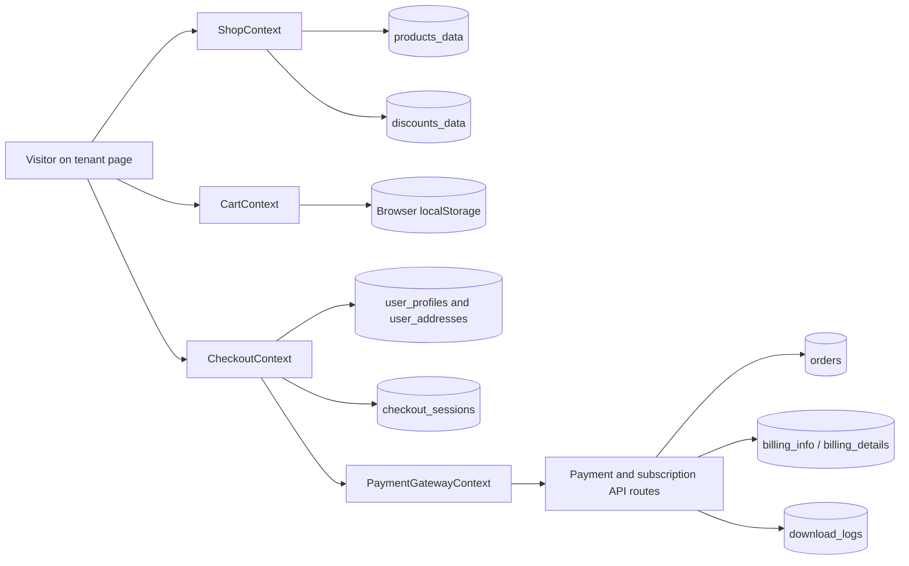

# Pocketlink

Creator pages, commerce, and AI-assisted layout generation in one Next.js App Router application.

Pocketlink combines public tenant pages, an authenticated editor dashboard, storefront and checkout flows, analytics, integrations, and Gemini-backed layout workflows. This README is a code-oriented map of the repository—not a deployment claim or a benchmark report.

## Key capabilities

| Surface | What the repository implements | Primary paths |
| --- | --- | --- |
| Public creator pages | Tenant pages render profile/layout data, products, subscriptions, a sales bot, and checkout UI. | [`app/[tenant]/`](app/%5Btenant%5D/), [`lib/actions/ReadTenantData.js`](lib/actions/ReadTenantData.js) |
| Custom domains | Hostnames are resolved to a tenant and rewritten to the tenant route; Cloudflare hostname/status routes manage verification state. | [`middleware.js`](middleware.js), [`middlewares/tenantRewriteMiddleware.js`](middlewares/tenantRewriteMiddleware.js), [`app/api/cloudflare/`](app/api/cloudflare/) |
| Dashboard and editor | Authenticated page editing, templates, themes, shop, analytics, marketing, sales bot, integrations, subscriptions, and settings. | [`app/dashboard/`](app/dashboard/), [`app/contexts/ItemsContext.jsx`](app/contexts/ItemsContext.jsx) |
| AI layouts | Resource extraction, research, content planning, building, QA, and repair produce desktop/mobile layout items and themes. | [`app/api/ai/generate-layout/`](app/api/ai/generate-layout/), [`app/api/ai/generate-onboarding-layout/`](app/api/ai/generate-onboarding-layout/) |
| Commerce | Products, discounts, carts, addresses, checkout sessions, orders, digital downloads, subscriptions, and payment-provider routes. | [`lib/helpers/supabaseProductHelpers.js`](lib/helpers/supabaseProductHelpers.js), [`app/contexts/CheckoutContext.jsx`](app/contexts/CheckoutContext.jsx), [`app/api/`](app/api/) |
| Analytics and integrations | Link/event/heatmap analytics plus Google, Instagram, Facebook, YouTube, Gmail, and PostHog integration surfaces. | [`lib/analyticsTrackers/`](lib/analyticsTrackers/), [`app/api/youtube/`](app/api/youtube/), [`app/api/integrations/`](app/api/integrations/), [`next.config.mjs`](next.config.mjs) |

## High-Level Architecture



At runtime, the request boundary is `middleware.js`. API requests receive CORS handling and continue to route handlers; non-API requests pass through Supabase session refresh/protection and then tenant-host resolution. The route tree supplies the public marketing surface, protected dashboard, tenant storefront, and backend API handlers.

## Detailed System Flows

### Request and tenant resolution



`getTenantNameMiddleware.js` recognizes `*.pocketlink.co`, local subdomains, and verified custom domains. Custom-domain results are cached in memory; the rewrite only serves a custom domain when Cloudflare verification and SSL status are both `active`.

### AI layout generation

The repository contains two related pipelines. Both use `gemini-2.0-flash` through `@google/generative-ai`; the resource providers can extract URLs, fetch HTML, and pass structured resources into the model stages.



The standard layout route accepts a description, optional URL/profile details, existing desktop/mobile items, a theme, a card count, and a generation mode (`fresh`, `retain`, or `update`). The onboarding route accepts categories, profile data, optional template items, and a theme.

### Storefront and checkout data flow



`CartContext` persists a validated cart in `localStorage`. `CheckoutContext` coordinates merchant discovery, profile/address data, checkout sessions, shipping, orders, and payment state. Payment and subscription handlers are implemented under [`app/api/`](app/api/), with provider-specific routes for Dodo Payments, Razorpay, Easebuzz, and PayU flows.

## Key components and implementation

| Component | Responsibility |
| --- | --- |
| [`middleware.js`](middleware.js) | API CORS handling, Supabase session refresh, protected-route redirect, and tenant rewrite dispatch. |
| [`Clients/supabase/`](Clients/supabase/) | Browser, server, build-time, and middleware Supabase clients using `@supabase/ssr`. |
| [`Clients/FireUserNameDb.js`](Clients/FireUserNameDb.js) | Main Firebase app with Firestore, Realtime Database, and Auth clients. |
| [`Clients/AIDB.js`](Clients/AIDB.js) | Firebase Realtime Database client for AI chat data. |
| [`Clients/analyticsDB.js`](Clients/analyticsDB.js) | Firebase Firestore and Realtime Database clients for analytics data. |
| [`app/contexts/`](app/contexts/) | Shared client state for auth, subscriptions, editor items, themes, shop, cart, checkout, analytics, campaigns, templates, and integrations. |
| [`app/dashboard/`](app/dashboard/) | Authenticated editing and operations surface: editor, analytics, shop, marketing, sales bot, integrations, subscriptions, and settings. |
| [`app/[tenant]/`](app/%5Btenant%5D/) | Tenant-specific profile/storefront rendering, product details, cart, checkout, subscribe flows, and sales bot. |
| [`app/api/ai/`](app/api/ai/) | Gemini-backed layout generation, onboarding generation, optimization, and generation logs. |
| [`lib/analyticsTrackers/`](lib/analyticsTrackers/) | Visit, button-click, attention, scroll-depth, and heatmap event persistence. |
| [`lib/helpers/`](lib/helpers/) | Supabase product, storage, payment-gateway, and screenshot helper functions. |
| [`database/`](database/) | SQL for download logging and Cloudflare custom-domain fields/status. |

### Access, subscriptions, and referral rewards

Supabase auth protects `/dashboard` and `/onboarding` in middleware. `AuthContext` synchronizes `user_data` and exposes referral-based feature/premium state. `SubscriptionContext` derives access from active subscription state, referral rewards, and trial dates; active referral rewards can be queued while a subscription is active and activated after subscription expiry.

The current code models `starter` and `business` subscription tiers, `billing_details`/`billing_info` records, and referral milestones at 12, 24, and 36 referrals. Feature thresholds and premium-gate behavior are defined in [`app/contexts/AuthContext.jsx`](app/contexts/AuthContext.jsx), [`app/contexts/SubscriptionContext.jsx`](app/contexts/SubscriptionContext.jsx), and [`constants/features.js`](constants/features.js).

## Tech stack

| Layer | Repository evidence |
| --- | --- |
| Application | Next.js `15.2.4`, React `19`, App Router route groups/dynamic segments, JavaScript/JSX with selected TypeScript files. |
| Styling and UI | Tailwind CSS, Radix UI primitives, local UI components, Framer Motion, GSAP, React DnD, and `@dnd-kit`. |
| Data and auth | Supabase JS/SSR, Firebase Auth, Firestore, and Realtime Database. |
| AI and content | Google Generative AI with `gemini-2.0-flash`, `cheerio`, `node-fetch`, and `jsonrepair`. |
| Commerce | Dodo Payments, Razorpay, Easebuzz, PayU, product/order helpers, Supabase Storage, and downloadable product files. |
| Analytics | Firebase-backed analytics tables/clients, PostHog browser/server packages, and `/ingest` rewrites in [`next.config.mjs`](next.config.mjs). |
| Visualization and editing | Recharts, AG Grid, MapLibre GL, Three.js, Quill, `react-grid-layout`, and drag/drop components. |
| Packaging and deployment | Node `22-slim` multi-stage [`Dockerfile`](Dockerfile) plus a single-replica Kubernetes Deployment and LoadBalancer Service in [`kubernetes/`](kubernetes/). |

## Repository structure

```text
.
├── app/
│   ├── (root)/                    Public marketing, auth, blog, templates, pricing, and claim routes
│   ├── [tenant]/                  Tenant pages, storefront, cart, checkout, and subscribe flows
│   ├── api/                       API route handlers, integrations, payments, analytics, and AI
│   ├── contexts/                  Shared React state and data orchestration
│   ├── dashboard/                 Protected editor and operations workspace
│   └── onboarding/                Protected onboarding flow
├── Clients/                       Supabase and Firebase clients
├── components/                    Shared UI, editor cards, dashboard components, and primitives
├── constants/                     Feature flags, pricing, themes, layout knowledge, and presets
├── database/                      SQL schema and migration files
├── hooks/                         Reusable client hooks
├── kubernetes/                    Deployment and service manifests
├── lib/                           Server actions, Supabase helpers, analytics trackers, and services
├── middlewares/                   Tenant and custom-domain resolution
├── public/                        Static images, PWA assets, icons, media, and payment-provider assets
├── scripts/                       Migration/setup helpers referenced by package scripts
├── types/                         Payment-related TypeScript types
├── Dockerfile                     Node 22 multi-stage production image
└── package.json                   Dependencies and development/operations scripts
```

## Setup and usage

The repository does not include a checked-in `.env.example`. Configure the environment from the `process.env` references in the source for the services you enable; keep credentials out of source control. The main integration groups are Supabase, Gemini, PostHog, payment providers, Cloudflare, Google/Instagram/Facebook/YouTube, email, and application URLs.

```bash
npm install
npm run dev
```

The development script starts Next.js with Turbopack and experimental HTTPS. The application metadata and tenant logic use `https://pocketlink.co` as the canonical site URL.

Other repository-provided entry points include:

```bash
npm run build
npm run start
npm run type-check
npm run lint:check
npm run format:check
npm run db:migrate
```

For containerized deployment, the included [`Dockerfile`](Dockerfile) builds and starts the Next.js production server on port `3000`. The Kubernetes manifests expose that container through a `LoadBalancer` service on port `80`.

## Relevant links and docs

- [AI layout generation notes](app/api/ai/generate-layout/README.md)
- [AI onboarding layout generation notes](app/api/ai/generate-onboarding-layout/README.md)
- [Download log schema](database/download_logs_schema.sql)
- [Cloudflare custom-domain migration](database/migrations/add_cloudflare_fields.sql)
- [Package scripts and dependency manifest](package.json)
- [Pocketlink](https://pocketlink.co)
- [Next.js App Router documentation](https://nextjs.org/docs/app)
- [Supabase SSR documentation](https://supabase.com/docs/guides/auth/server-side/nextjs)
